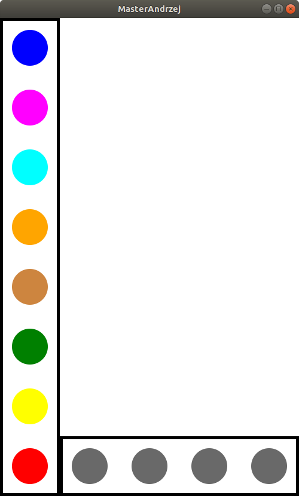

#m1

**1. Podział pracy**

Pracę rozłożyliśmy w taki sposób, aby każda osoba miała tak samo wymagające i czasochłonne zadania.

* Beata Posłuszny -> Model (`Board`, `CodeWord`, `Guess`)
* Andrzej Ratajczak -> Widok (`BoardView`, `DispenserView`, `GuessView`)
* Kamil Tomala -> Kontroler (`BoardController`, `GuessController`, `DragHandler`, `DispenserController`)
* Kacper Korban -> Zainicjalizowanie projektu i zależności (`Main`, `MasterMindModule`, `AbstractController`)

**2. Demo działania programu**

**3. Pełny widok GUI**

**4. Schemat pełnego programu**

**5. Sposób uruchomienia 1 (Intellij)**

* Sklonować projekt
* W Intellij zaimportować jako projekt gradle
* Poczekać aż pobiorą się zależności i uruchomić metodę `Launcher.main`

**6. Sposób uruchomienia 1 (konsola)**

* Sklonować projekt
* Otworzyć konsolę w katalogi projektu
* Wpisać komendę `gradle wrapper`, a następnie `./gradlew run`
