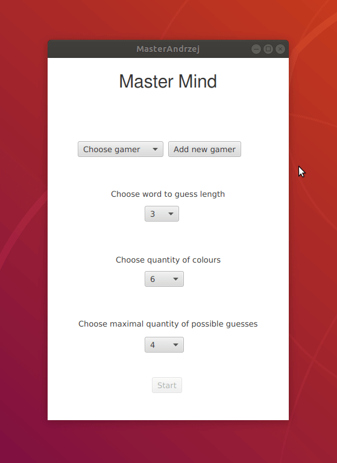
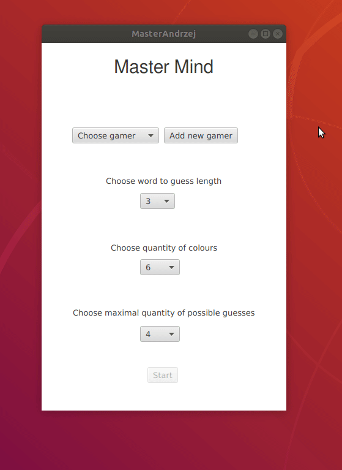
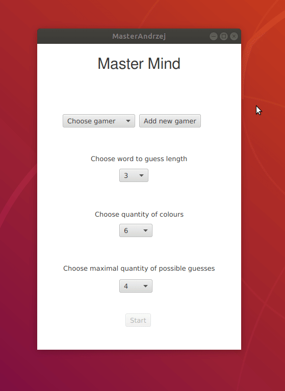

#m3

**1. Podział pracy**

Na podstawie wymagań dało się nam wydzielić 4 (prawie) niezależne zadania. Dzięki czemu praca była rozłożona równo między wszystkimi członkami zespołu.

* Beata Posłuszny -> Dodawanie i ustawianie gracza
* Andrzej Ratajczak -> Obsługa e-maili
* Kamil Tomala -> Konfiguracja bazy danych i usprawnienia UX
* Kacper Korban -> Obsługa najlepszych wyników

**2. Demo działania programu**

